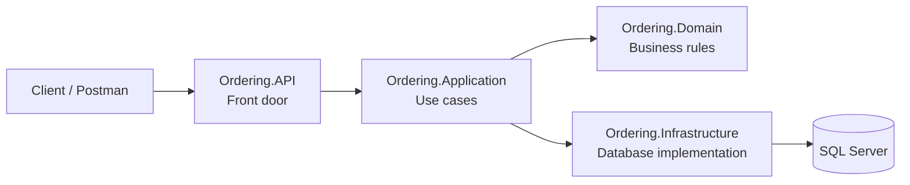

# Ordering Microservice: Clean Architecture Layers

## The main idea

The two course screenshots do not have a perfect one-to-one mapping:

- The first screenshot shows **conceptual Clean Architecture rings**.
- The second screenshot shows the **actual .NET projects/layers** used to organize the Ordering microservice.

## Layer mapping

| Project in the second screenshot | Area in the first screenshot | Responsibility |
|---|---|---|
| `Ordering.Domain` | **Entities** — yellow center | Orders, value objects, aggregates, domain events, and business rules |
| `Ordering.Application` | **Use Cases** — red ring | Commands, queries, handlers, validation, and application workflows |
| `Ordering.API` | **Controllers** — green ring, plus **Web** — blue ring | Carter endpoints, HTTP requests and responses, exception handling, and application startup |
| `Ordering.Infrastructure` | **Gateways** — green ring, plus **Database** — blue ring | EF Core, repositories, database mappings, migrations, interceptors, and SQL Server access |

## Simple flow



In plain text:

```text
Client / Postman
       |
       v
Ordering.API              Receives the HTTP request
       |
       v
Ordering.Application      Runs the requested use case
       |
       v
Ordering.Domain           Applies the business rules
       |
       v
Ordering.Infrastructure   Saves or reads the data using EF Core
       |
       v
SQL Server                Stores the data
```

## Example: creating an order

1. `Ordering.API` receives an HTTP request such as `POST /orders`.
2. The API sends a `CreateOrderCommand` to `Ordering.Application`.
3. The command handler coordinates the create-order use case.
4. `Ordering.Domain` creates or changes the `Order` and enforces its business rules.
5. `Ordering.Infrastructure` uses EF Core to save the order.
6. SQL Server stores the order data.
7. The result travels back through the Application and API layers to the client.

## Easy mental model

### Domain = the business brain

It answers questions such as:

- What is an order?
- What information must an order contain?
- Which changes are allowed?
- Which business rules must always be respected?

Examples include `Order`, `OrderItem`, value objects, aggregates, and domain events.

### Application = the use-case coordinator

It answers:

- What steps should happen when the user creates an order?
- What should happen when the user updates or cancels an order?
- Which command or query handler should run?

Examples include commands, queries, handlers, validators, and MediatR pipeline behaviours.

### Infrastructure = the technical tools

It answers:

- How is an order saved in SQL Server?
- How does EF Core map the domain objects to database tables?
- How are migrations and database connections handled?

Examples include `DbContext`, EF Core configurations, migrations, repositories, and interceptors.

### API = the front door

It answers:

- Which URL should the client call?
- Which HTTP method should be used?
- How is the request converted into a command or query?
- What HTTP response should be returned?

Examples include Carter endpoints, request and response models, exception handling, and `Program.cs`.

## Important clarification about Docker

These four layers are **not four separate microservices** and they do not need four Docker containers.

They are four code projects/layers that work together as one **Ordering microservice**. When the solution runs:

- The `Ordering.API` project is the startup project.
- It loads and uses the Application, Domain, and Infrastructure projects.
- Docker packages this complete Ordering application into the **Ordering API container**.
- SQL Server normally runs in a separate database container.

So the phrase **Ordering API container** in the first screenshot means the running Ordering microservice. It does not mean that the container contains only the API layer.

## One-sentence summary

**API receives the request, Application coordinates the use case, Domain applies the business rules, and Infrastructure communicates with SQL Server.**
